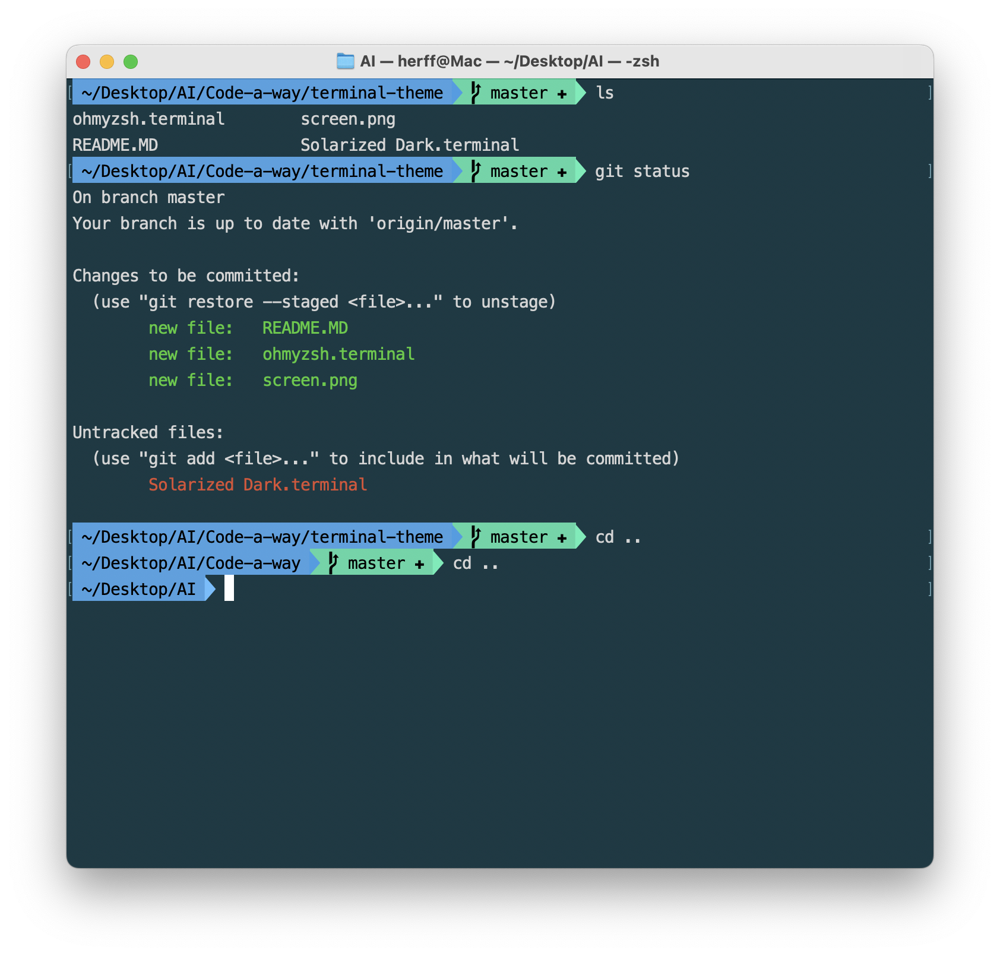

# terminal-theme(macOS)




1. 终端输入以下命令安装ohmyzsh:
```bash
sh -c "$(curl -fsSL https://raw.githubusercontent.com/ohmyzsh/ohmyzsh/master/tools/install.sh)"
```
2. 安装字体：
```bash
brew install --cask font-meslo-lg-nerd-font
```
3. 双击`ohmyzsh.terminal` 或 `Solarized Dark.terminal`安装终端主题
4. 配置ohmyzsh主题
```bash
# 编辑配置文件
vi ~/.zshrc
# 指定主题
ZSH_THEME="agnoster"

# 可选项，隐藏用户和主机名
prompt_context(){}
```
更多配置选项，详见[ohmyzsh文档](https://github.com/ohmyzsh/ohmyzsh/wiki)
